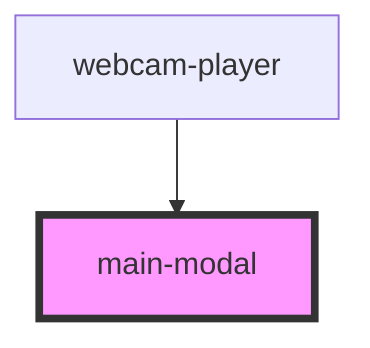

# main-modal

<!-- Auto Generated Below -->

## Properties

| Property       | Attribute | Description | Type                     | Default     |
| -------------- | --------- | ----------- | ------------------------ | ----------- |
| `cancelModal`  | --        |             | `() => void`             | `undefined` |
| `handleResult` | --        |             | `(name: string) => void` | `undefined` |

## Dependencies

### Used by

 - [webcam-player](../webcam-player)

### Graph

----------------------------------------------

*Built with [StencilJS](https://stenciljs.com/)*
