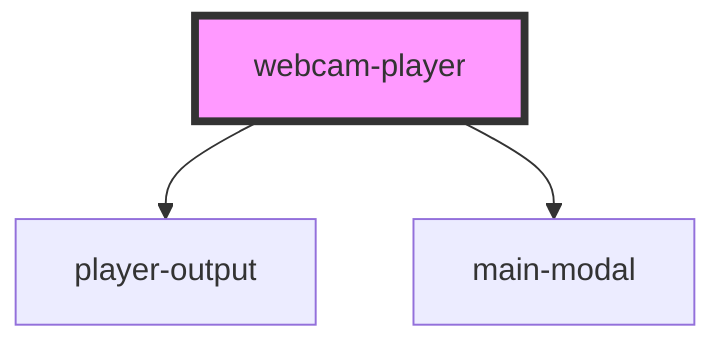

# webcam-player

<!-- Auto Generated Below -->

## Events

| Event                | Description | Type               |
| -------------------- | ----------- | ------------------ |
| `screenshotReceived` |             | `CustomEvent<any>` |

## Dependencies

### Depends on

- [player-output](../player-output)
- [main-modal](../main-modal)

### Graph

----------------------------------------------

*Built with [StencilJS](https://stenciljs.com/)*
